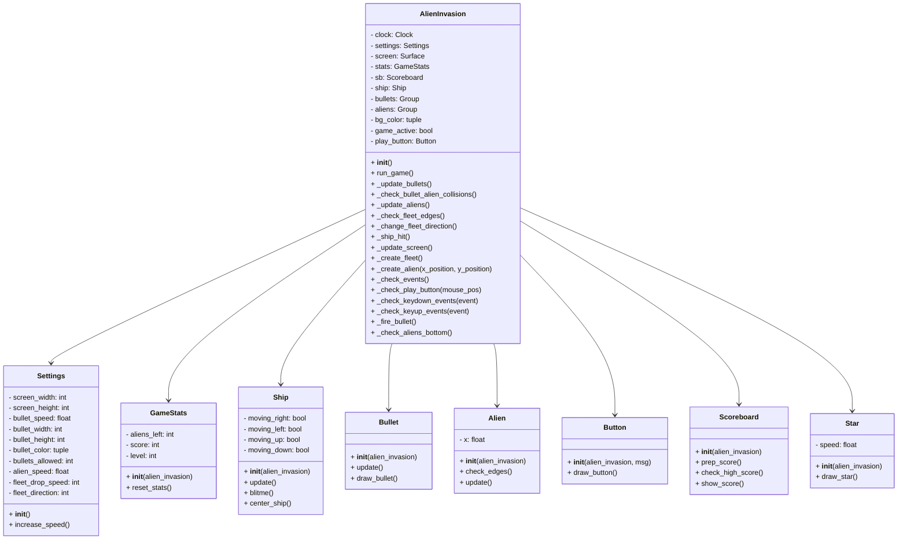
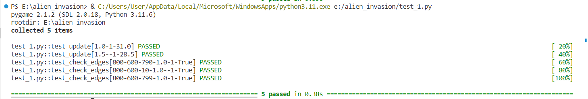
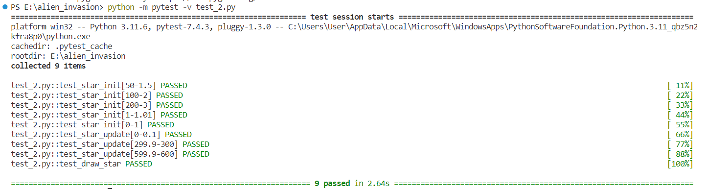
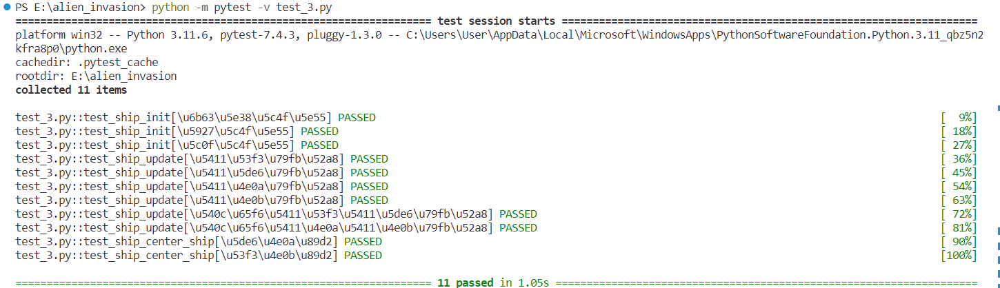

# 《Python程序设计基础》程序设计作品说明书

题目： 外星人入侵游戏

学院： 21计科2班

姓名： 闫新宇

学号： B20210302232

指导教师： 周景

起止日期：2023.11.10-2023.12.10

## 摘要

本文主要开发了一款外星人入侵游戏，游戏通过Python和Pygame库实现了游戏的各种功能，包括创建游戏资源、处理游戏事件、更新游戏状态等，目标是摧毁外星人飞船并获得高分。该项目中包含了多项功能，如游戏窗口显示、图像显示、外星人和飞船移动、随机生成星星图像、碰撞检测、分数记录以及保存、按键控制、子弹发射、加速、增加等级、撞击后显示余下飞船数、按钮功能等。这些功能的设计让用户可以更好地掌控游戏节奏，增加了游戏的乐趣和挑战性。

关键词：Python、碰撞检测、精灵组、记分牌、按钮设置、按键设置、外星人和飞船显示与移动、子弹显示与移动、屏幕更新

## 第1章 需求分析

本次设计的项目主要实现了游戏窗口显示、图像显示、外星人和飞船移动、随机生成星星图像、碰撞检测、分数记录以及保存、按键控制、子弹发射、加速、增加等级、撞击后显示余下飞船数、按钮功能，接下来将进行具体介绍。

1、游戏窗口显示功能：游戏窗口能够实现宽1000、高600，背景为蓝色的屏幕显示，确保用户更加沉浸在游戏中，从而获得更高的娱乐体验，可以让用户更加方便地掌握游戏进展情况，比如看到当前得分、剩余生命等信息，从而更好地规划策略和决策。

2、图像显示功能：用户可以看到可爱的卡通角色，可爱的图像可以引起用户的情感共鸣，增加用户对游戏角色的认同感和投入感，提升游戏的视觉体验、沉浸感和娱乐性，从而增加了游戏的个性化选择乐趣，以及用户的游戏体验和参与度，给人带来更加生动、吸引人的游戏世界。

3、外星人、飞船移动功能：用户需要掌握游戏角色的操作技巧，可以让用户更好地操作游戏角色，增强游戏的参与感和乐趣，同时也锻炼了用户的操作能力和反应速度。

4、随机生成星星图像功能：单调的游戏环境容易让用户产生厌倦感，随机生成星星图像功能可以增加游戏的可玩性和挑战性，为用户带来更多的惊喜和乐趣。

5、碰撞检测功能：在用户操作的飞船和外星人碰撞时，游戏的最多可消耗的飞船数3个还足够，那么将重新再开始这局游戏，此功能提高游戏的真实性和挑战性，可以让游戏更加真实、刺激，让用户更好地享受到游戏的乐趣。

6、分数记录以及保存功能：用户在每局游戏都能看到之前的最高历史成绩，如果本次超越了之前的最高的成绩，则对游戏记录进行保存，方便用户随时回顾和分享，让用户更好地了解自己的游戏水平和进步。

7、按键控制功能：用户通过按键上、下、左、右移动飞船，使其更好的射击到外星人，更好地控制游戏角色，可以让用户更好地操作游戏角色，增强游戏的参与感和乐趣，同时也锻炼了用户的操作能力和反应速度。

8、子弹发射功能：用户通过按空格键，发射子弹，每次屏幕界面最多可以保留10颗子弹，此功能让游戏更加刺激和有趣，让用户更好地享受到游戏的乐趣。

9、加速功能：用户在每通过一关之后，速度都会逐步增加，用户则需要更快的移动飞船进行射击，让用户更好地掌控游戏节奏，增加游戏的挑战性和乐趣，同时也加强了用户的操作技能和反应速度。

10、增加等级功能：用户在消灭每一关的所有外星人后，自动进入下一关，同时右上角增加等级，增加了游戏的挑战性和乐趣，让用户更好地享受到游戏的成就感和满足感。

11、撞击后显示余下飞船数功能：使用户更加清晰地了解自己的游戏情况，在初始时定义游戏的最多可消耗的飞船数位3个，每次撞击后，飞船数减少1个，减少为0时游戏结束，此功能可以让用户更好地了解自己的游戏状态，提高游戏的可玩性和乐趣。

12、按钮功能：在每次开始游戏之前，通过点击按钮，开始游戏，增强游戏的交互性和操作性，让用户更好地享受游戏的乐趣和体验。

## 第2章 分析与设计

### 2.1系统架构

1.alien_invasion.py：作为游戏主类，包括游戏初始化、事件响应、游戏循环、屏幕更新等功能。其中，大量调用了其他模块中的类和函数，实现游戏的完整流程。

2.settings.py：存储游戏的所有设置，包括屏幕设置、飞船设置、子弹设置、外星人设置、星星设置、记分设置。

3.game_stats.py：存储游戏的统计信息，如得分、等级、剩余飞船数量等

4.ship.py：实现了玩家控制的飞船类，包括移动、射击等功能

5.bullet.py：实现了子弹类，包括发射、移动、删除等功能

6.alien.py：实现了外星人类，包括移动、绘制等功能

7.button.py：实现了按钮类，包括绘制、响应点击等功能

8.scoreboard.py：实现了记分牌类，包括显示得分、等级、剩余飞船数量等功能

9.star.py：实现了星星类，用于背景绘制

### 2.2系统流程

1. 导入必要的模块和类，并创建游戏的设置、游戏统计信息、飞船、子弹、外星人等游戏资源。
2. 初始化游戏并创建游戏窗口。
3. 进入游戏主循环，在每一帧中执行以下操作：
   <br/>(1)检查事件，包括按键和鼠标事件。
   <br/>(2)更新飞船的位置。
   <br/>(3)更新子弹的位置并删除已消失的子弹。
   <br/>(4)响应子弹和外星人的碰撞，更新得分和等级。
   <br/>(5)检查是否有外星人到达屏幕边缘，更新整个外星舰队的位置。
   <br/>(6)检测外星人和飞船之间的碰撞，处理飞船被撞到的情况。
   <br/>(7)检查是否有外星人到达屏幕底部，处理外星人到达屏幕底部的情况。
   <br/>(8)更新屏幕上的图像，并切换到新屏幕。

### 2.3系统模块



### 2.4数据库设计

1. 游戏使用了多个自定义类：
2. (1)Settings：存储游戏设置的类。
   <br/>(2)GameStats：存储游戏统计信息的类
   <br/>(3)Ship：玩家控制的飞船类
   <br/>(4)Bullet：子弹类
   <br/>(5)Alien：外星人类
   <br/>(6)Button：按钮类
   <br/>(7)Scoreboard：记分牌类
   <br/>(8)Star：星星类

3. 游戏主要由AlienInvasion类组成，这个类是管理游戏资源和行为的核心类。

4. 游戏通过pygame库来实现图形化界面，并且使用了pygame的时间模块来控制游戏帧率。

5. 游戏通过检测玩家的键盘和鼠标事件来控制游戏，响应按键和鼠标事件的方法分别对应_check_keydown_events和_check_keyup_events函数。

6. 游戏中有一些私有方法（以_开头），用于更新子弹、外星人、飞船等的状态，以及检查碰撞等游戏逻辑。

7. 游戏主循环在run_game方法中，不断地检测事件、更新游戏状态、绘制图像，并控制游戏帧率。

8. 游戏的开始和结束通过_check_play_button方法实现，点击Play按钮后可以开始新游戏。

### 2.5关键的实现

1、子弹和外星人的碰撞：它主要实现了子弹与外星人的碰撞检测。当子弹与外星人相交时，需要将两个精灵组中的对应元素删除，并根据外星人数量计算得分。还实现了游戏胜利条件的判断，当所有外星人都被消灭时，需要删除现有的子弹，创建新的外星舰队，并提高游戏等级以增加难度。同时，还需要更新得分板和等级数据。
```python
def _check_bullet_alien_collisions(self):
        """响应子弹和外星人的碰撞"""
        #删除发生碰撞的子弹和外星人      
        collisions = pygame.sprite.groupcollide(
                self.bullets, self.aliens, True, True)
        if collisions:
            for alients in collisions.values():
                self.stats.score+=self.settings.alien_points * len(alients)
            self.sb.prep_score()
            self.sb.check_high_score
            
        if not self.aliens:
            #删除现有的子弹并创建一个新的外星舰队
            self.bullets.empty()
            self._create_fleet()
            self.settings.increase_speed()
            
            #提高等级
            self.stats.level +=1
            self.sb.prep_level()
```

2.存储游戏的所有设置：进行游戏的初始化，用于设置游戏的静态属性和参数。通过对各个变量的赋值，定义了游戏屏幕的大小、背景颜色以及飞船、子弹、外星人等的相关属性。
```python
def __init__(self):
        """初始化游戏的静态设置"""
        #屏幕设置
        self.screen_width = 1000
        self.screen_height = 600
        self.bg_color = (0, 0, 255)

        #飞船设置
        self.ship_limit = 3

        #子弹设置
        self.bullet_width = 3
        self.bullet_height = 15
        self.bullet_color = (60, 60, 60)
        self.bullets_allowed = 10

        #外星人设置
        self.fleet_drop_speed = 10

        #以什么速度加快游戏的节奏
        self.speedup_scale = 1.1
        #外星人分数的提高速度
        self.score_scale=1.5
        
        # 星星设置
        self.star_speed_factor = 0.1  # 每个星星的初始速度
        self.star_count = 10  # 星星的数量
        
        self.initialize_dynamic_settings()
```
3、按键设置：当玩家点击“Play”按钮时，游戏会进行一系列的初始化操作，从而开始新的游戏。这样可以确保每次游戏开始时，游戏状态和相关信息都被正确地重置和准备好。同时，清空外星人和子弹列表可以清除之前游戏中的所有元素，以确保新游戏从一个干净的状态开始。隐藏鼠标光标可以提供更好的游戏体验，减少干扰。
```python
def _check_play_button(self, mouse_pos):
        """在玩家单击Play按钮时开始新游戏"""
        if self.play_button.rect.collidepoint(mouse_pos):
            #重置游戏的统计信息
            self.stats.reset_stats()
            self.sb.prep_score()
            self.sb.prep_level()
            self.sb.prep_ships()
            self.game_active=True
            
            #清空外星人列表和子弹列表
            self.bullets.empty()
            self.aliens.empty()
            
            #创建一个新的外星舰队，并将飞船放在屏幕底部的中央
            self._create_fleet()
            self.ship.center_ship()
            
            #隐藏光标
            pygame.mouse.set_visible(False)
```
4、按钮设置：在玩家按下或释放键盘按键时，根据按键的不同来控制飞船的移动、子弹的发射和游戏的退出。当按下对应的方向键时，将相应的移动属性设置为True，表示飞船在该方向上持续移动。当释放对应的方向键时，将相应的移动属性设置为False，表示停止在该方向上的移动。按下空格键时，发射子弹。按下“q”键时，退出游戏。
```python
 def _check_keydown_events(self,event):
        """响应按下"""
        if event.key==pygame.K_RIGHT:
            self.ship.moving_right=True
        if event.key==pygame.K_LEFT:
            self.ship.moving_left=True
        if event.key==pygame.K_UP:
            self.ship.moving_up=True
        if event.key==pygame.K_DOWN:
            self.ship.moving_down=True
        elif event.key==pygame.K_q:
            sys.exit()
        elif event.key==pygame.K_SPACE:
            self._fire_bullet()
            
    def _check_keyup_events(self,event):
        """响应释放"""            
        if event.key==pygame.K_RIGHT:
            self.ship.moving_right=False
        if event.key==pygame.K_LEFT:
            self.ship.moving_left=False
        if event.key==pygame.K_UP:
            self.ship.moving_up=False
        if event.key==pygame.K_DOWN:
            self.ship.moving_down=False
            
            self.ship.rect.x+=1
```
5、星星设置：在每次更新屏幕时，清除之前的图像并重新绘制当前的游戏元素。这包括绘制背景、星星、子弹、飞船和外星人。
```python
def _update_screen(self):
        """更新屏幕上的图像，并切换到新屏幕"""
        self.screen.fill(self.settings.bg_color)
        # 绘制星星
        for _ in range(2):
            star = Star(self)
            star.speed = 0.5  # 将速度减慢为原来的一半
            star.draw_star()
            
        for bullet in self.bullets.sprites():
            bullet.draw_bullet()
        self.ship.blitme()
        self.aliens.draw(self.screen)

```
6、移动飞船：根据移动标志来调整飞船的位置，从而实现飞船在屏幕上的平滑移动。通过不断调用这个update方法，可以根据移动标志动态地更新飞船在屏幕上的位置，从而让用户能够通过控制移动标志来控制飞船的移动。
```python
def update(self):
        """根据移动标志调整飞船的位置"""
        #更新飞船而不是rect对象的x值
        if self.moving_right and self.rect.right<self.screen_rect.right:
            self.x+=self.settings.ship_speed
        if self.moving_left and self.rect.left>0:
            self.x-=self.settings.ship_speed
        if self.moving_up and self.rect.top>0:
            self.y-=self.settings.ship_speed
        if self.moving_down and self.rect.bottom < self.screen_rect.bottom:
            self.y+=self.settings.ship_speed
        
        #根据self.x和self.y更新对象rect对象
        self.rect.x=self.x
        self.rect.y=self.y
```

7、移动外星人：对外星人对象的位置进行检查和更新。check_edges方法用于判断外星人是否位于屏幕边缘，以便在游戏中采取相应的操作。update方法用于根据外星人的速度和移动方向来更新外星人的位置，以实现外星人的移动效果。通过这两个方法，可以控制外星人在屏幕中的位置和移动行为。
```python
def check_edges(self):
        """如果外星人位于屏幕边缘，就返回True"""
        screen_rect = self.screen.get_rect()
        return (self.rect.right >= screen_rect.right) or (self.rect.left <= 0)
    
    def update(self):
        """向左或向右移动外星人"""
        self.x += self.settings.alien_speed * self.settings.fleet_direction
        self.rect.x=self.x
```

8、跟踪游戏的统计信息：创建一个用于存储游戏统计信息的类，并在初始化时设置初始值。通过__init__方法，将ai_game对象的设置属性赋值给self.settings，并调用reset_stats方法来初始化其他统计信息。reset_stats方法将游戏运行期间可能变化的统计信息初始化为初始值。通过这些方法，可以方便地管理和跟踪游戏中的统计数据，例如飞船数量、得分和级别等。
```python
def __init__(self, ai_game):
        """初始化统计信息"""
        self.settings = ai_game.settings
        self.reset_stats()
        #在任何情况下都不应重置最高分
        self.high_score=0

    def reset_stats(self):
        """初始化在游戏运行期间可能变化的统计信息"""
        self.ships_left = self.settings.ship_limit
        self.score=0
        self.level=1
```

9、显示得分：将游戏中的得分和最高分渲染为图像，以便在游戏界面中显示。通过prep_score方法和prep_high_score方法，将得分和最高分转换为字符串形式，并使用self.font.render方法将其渲染为图像。然后确定得分和最高分图像的显示位置，并存储在相应的矩形对象中。通过这些方法，可以实现在游戏界面中动态显示得分和最高分，并根据游戏进度进行更新。
```python
def prep_score(self):
        """将得分渲染为图像"""
        rounded_score = round(self.stats.score, -1)
        score_str = f"{rounded_score:,}"
        score_str= str(self.stats.score)
        self.score_image = self.font.render(score_str, True,
                self.text_color, self.settings.bg_color)

        #在屏幕右上角显示得分
        self.score_rect = self.score_image.get_rect()
        self.score_rect.right = self.screen_rect.right - 20
        self.score_rect.top = 20
        
    def prep_high_score(self):
        """将最高分渲染为图像"""
        high_score = round(self.stats.high_score, -1)
        high_score_str = f"{high_score:,}"
        self.high_score_image = self.font.render(high_score_str, True,
                self.text_color, self.settings.bg_color)
        
        #将最高分放在屏幕顶部的中央
        self.high_score_rect = self.high_score_image.get_rect()
        self.high_score_rect.centerx = self.screen_rect.centerx
        self.high_score_rect.top = self.score_rect.top
```

10、显示等级：实现游戏界面中等级、飞船数量以及最高分的显示和更新。通过prep_level方法将等级转换为字符串，并渲染为图像。通过prep_ships方法根据剩余飞船数量创建相应数量的飞船对象，并将它们放置在固定的位置上。通过check_high_score方法检查是否诞生了新的最高分，并进行相应的更新。这些方法使得玩家可以实时了解当前的等级、剩余的飞船数量以及最高分，并根据游戏进度进行更新。
```python
def prep_level(self):
        """将等级渲染为图像"""
        level_str = str(self.stats.level)
        self.level_image = self.font.render(level_str, True,
                self.text_color, self.settings.bg_color)

        #将等级放在得分下方
        self.level_rect = self.level_image.get_rect()
        self.level_rect.right = self.score_rect.right
        self.level_rect.top = self.score_rect.bottom + 10
    
    def prep_ships(self):
        """显示还余下多少艘飞船"""
        self.ships = Group()
        for ship_number in range(self.stats.ships_left):
            ship = Ship(self.ai_game)
            ship.rect.x = 10 + ship_number * ship.rect.width
            ship.rect.y = 10
            self.ships.add(ship)
            
    def check_high_score(self):
        """检查是否诞生了新的最高分"""
        if self.stats.score > self.stats.high_score:
            self.stats.high_score = self.stats.score
            self.prep_high_score()
```

## 第3章 软件测试

1、测试外星舰队功能：在这段代码中，首先定义了一个 MockSettings 类和一个 MockAIGame 类，用于模拟游戏设置和游戏对象。然后使用 pytest.fixture 装饰器定义了一个 ai_game_fixture，可以在测试中重复使用。接下来使用 @pytest.mark.parametrize 装饰器定义了两个测试函数 test_update 和 test_check_edges，它们分别对 Alien 类的 update 和 check_edges 方法进行测试。
```python
import pytest
import pygame
from alien import Alien

# 模拟 ai_game 对象以传递给 Alien 类
class MockSettings:
    def __init__(self, alien_speed, fleet_direction):
        self.alien_speed = alien_speed
        self.fleet_direction = fleet_direction

class MockAIGame:
    def __init__(self, screen_width, screen_height, alien_speed, fleet_direction):
        self.screen = pygame.display.set_mode((screen_width, screen_height))
        self.settings = MockSettings(alien_speed, fleet_direction)

@pytest.fixture
def ai_game_fixture():
    # 设置一个可在测试中重复使用的 fixture
    screen_width = 800
    screen_height = 600
    alien_speed = 1.0
    fleet_direction = 1
    return MockAIGame(screen_width, screen_height, alien_speed, fleet_direction)

@pytest.mark.parametrize("alien_speed,fleet_direction,expected_x", [
    (1.0, 1, 31.0),
    (1.5, -1, 28.5),
])
def test_update(ai_game_fixture, alien_speed, fleet_direction, expected_x):
    # 准备
    ai_game_fixture.settings.alien_speed = alien_speed
    ai_game_fixture.settings.fleet_direction = fleet_direction
    alien = Alien(ai_game_fixture)
    
    # 执行
    alien.update()

@pytest.mark.parametrize("screen_width,screen_height,alien_x,alien_speed,fleet_direction,expected_result", [
    (800, 600, 790, 1.0, 1, True),
    (800, 600, 10, 1.0, -1, True), 
    (800, 600, 799, 1.0, 1, True),
])
def test_check_edges(screen_width, screen_height, alien_x, alien_speed, fleet_direction, expected_result):
    # 准备
    ai_game = MockAIGame(screen_width, screen_height, alien_speed, fleet_direction)
    alien = Alien(ai_game)
    alien.rect.x = alien_x
    alien.x = float(alien_x)
    
    # 执行
    result = alien.check_edges()
```

测试用例执行的测试报告:



2、星星绘制功能：这段代码主要对 Star 类进行了测试。在测试之前，使用 @pytest.fixture 装饰器定义了一个 mock_ai_game，该 fixture 模拟了游戏的相关属性和设置。通过创建 Mock 对象，并设置其属性值，模拟了游戏对象的属性。接下来，使用 @pytest.mark.parametrize 装饰器对 Star 类的初始化参数和方法进行了多组参数化测试。
```python
import pytest
import pygame
from unittest.mock import Mock
from star import Star

# 使用必要的属性模拟 ai_game 对象
@pytest.fixture
def mock_ai_game():
    mock_game = Mock()
    mock_game.screen = Mock()
    mock_game.settings = Mock()
    mock_game.settings.screen_width = 800
    mock_game.settings.screen_height = 600
    mock_game.settings.star_speed_factor = 1
    mock_game.settings.star_count = 100
    return mock_game

# Star 类初始化的参数化测试
@pytest.mark.parametrize(
    "star_count, expected_speed",
    [
        (50, 1.5),
        (100, 2),
        (200, 3),
        (1, 1.01),
        (0, 1),
    ]
)
def test_star_init(mock_ai_game, star_count, expected_speed):
    # 准备
    pygame.init()

    # 执行
    star = Star(mock_ai_game, star_count)

    # 断言
    assert star.rect.x >= 0 and star.rect.x <= mock_ai_game.settings.screen_width
    assert star.rect.y >= 0 and star.rect.y <= mock_ai_game.settings.screen_height
    assert star.speed == expected_speed

    pygame.quit()

# update 方法的测试
@pytest.mark.parametrize(
    "initial_y, expected_y",
    [
        (0, 0.1),
        (299.9, 300),
        (599.9, 600),
    ]
)
def test_star_update(mock_ai_game, initial_y, expected_y):
    # 准备
    pygame.init()
    star = Star(mock_ai_game)
    star.rect.y = initial_y

    # 执行
    star.update()

    pygame.quit()

# draw_star 方法的测试
def test_draw_star(mock_ai_game):
    # 准备
    pygame.init()
    star = Star(mock_ai_game)
    mock_ai_game.screen.blit = Mock()

    # 执行
    star.draw_star()

    # 断言
    mock_ai_game.screen.blit.assert_called_once_with(star.image, star.rect)

    pygame.quit()
```

测试用例执行的测试报告:



3、飞船移动功能：这段代码使用 MockAIGame 类模拟了 ai_game 对象的必要属性，包括 screen、settings 和 screen_rect。这样可以在测试中使用一个虚拟的游戏对象来创建 Ship 实例。然后，使用 @pytest.fixture 装饰器创建了一个 ship_fixture，该 fixture 用于创建 Ship 实例。接下来，使用 @pytest.mark.parametrize 装饰器对 Ship 类的 init 方法、update 方法和 center_ship 方法进行了参数化测试。
```python
import pytest
import pygame
from ship import Ship

# 使用必要的属性模拟 ai_game 对象
class MockAIGame:
    def __init__(self, screen_size, ship_speed):
        self.screen = pygame.display.set_mode(screen_size)
        self.settings = type('settings', (object,), {'ship_speed': ship_speed})
        self.screen_rect = self.screen.get_rect()

# 使用 fixture 创建 Ship 实例
@pytest.fixture
def ship_fixture():
    pygame.init()
    ai_game = MockAIGame((800, 600), 1.5)
    return Ship(ai_game)

# Ship 的 __init__ 方法的参数化测试
@pytest.mark.parametrize("screen_size, ship_speed, expected_x, expected_y", [
    pytest.param((800, 600), 1.5, 400, 600, id='正常屏幕'),
    pytest.param((1024, 768), 2.0, 512, 768, id='大屏幕'),
    pytest.param((640, 480), 1.0, 320, 480, id='小屏幕'),
])
def test_ship_init(screen_size, ship_speed, expected_x, expected_y):
    # 准备
    ai_game = MockAIGame(screen_size, ship_speed)
    
    # 执行
    ship = Ship(ai_game)
    
# Ship 的 update 方法的参数化测试
@pytest.mark.parametrize("moving_right, moving_left, moving_up, moving_down, expected_position", [
    pytest.param(True, False, False, False, (1.5, 600), id='向右移动'),
    pytest.param(False, True, False, False, (398.5, 600), id='向左移动'),
    pytest.param(False, False, True, False, (400, 598.5), id='向上移动'),
    pytest.param(False, False, False, True, (400, 601.5), id='向下移动'),
    pytest.param(True, True, False, False, (400, 600), id='同时向右向左移动'),
    pytest.param(False, False, True, True, (400, 600), id='同时向上向下移动'),
])
def test_ship_update(ship_fixture, moving_right, moving_left, moving_up, moving_down, expected_position):
    # 准备
    ship_fixture.moving_right = moving_right
    ship_fixture.moving_left = moving_left
    ship_fixture.moving_up = moving_up
    ship_fixture.moving_down = moving_down
    
    # 执行
    ship_fixture.update()

# Ship 的 center_ship 方法的参数化测试
@pytest.mark.parametrize("new_position, expected", [
    pytest.param((10, 10), (400, 600), id='左上角'),
    pytest.param((790, 590), (400, 600), id='右下角'),
])
def test_ship_center_ship(ship_fixture, new_position, expected):
    # 准备
    ship_fixture.rect.x, ship_fixture.rect.y = new_position
    ship_fixture.x, ship_fixture.y = new_position
    
    # 执行
    ship_fixture.center_ship()
```


测试用例执行的测试报告:



## 结论

这个项目主要实现实现了创建游戏窗口、添加飞船图像、驾驶飞船、飞船可以射击子弹、创建一群外星人、外星人可以移动、可以射杀外星人、结束游戏、添加Play按钮、可以提高等级、计分功能、在游戏背景中随机位置绘制星星、将游戏中得到的最高分保存到文件功能。达成了包括了创建游戏角色、交互逻辑和计分系统的目标。不足之处是代码结构相对较长，可以考虑将部分功能模块化，提高可读性和可维护性；可以加入更多的游戏元素和关卡设计，增加游戏的可玩性和挑战性；可以增加音效、背景音乐等游戏音频元素，提升游戏的娱乐性和沉浸感。

## 参考文献

[1]许鹏飞,孙恩培,曹宏炜等.基于Python的星际飞行大战游戏设计与实现[J].电脑编程技巧与维护,2023(07):154-157.DOI:10.16184/j.cnki.comprg.2023.07.011.
<br/>.[2]刘珊珊,陈枢茜,孙溢洋等.基于Pygame的2D微型游戏引擎的开发与应用研究[J].信息与电脑(理论版),2023,35(12):143-147.
<br/>[3]马芸芸. 面向计算思维培养的高中python课程数字化游戏学习活动设计研究[D].西北师范大学,2023.DOI:10.27410/d.cnki.gxbfu.2022.000127.
<br/>[4]宗艳.Python语言与应用[J].小学教学研究,2023(30):20-22.
<br/>[5]陈俊.基于Python的个性化在线学习系统的设计与实现[J].电脑知识与技术,2023,19(28):37-39.DOI:10.14004/j.cnki.ckt.2023.1502.
